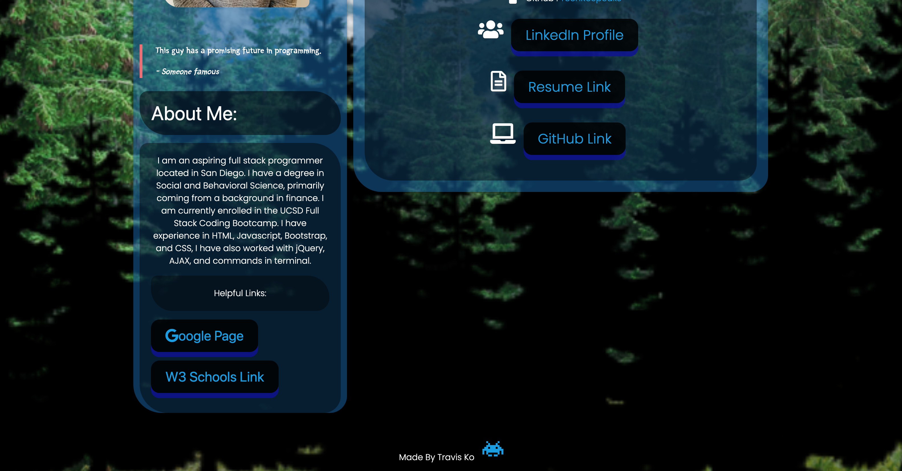
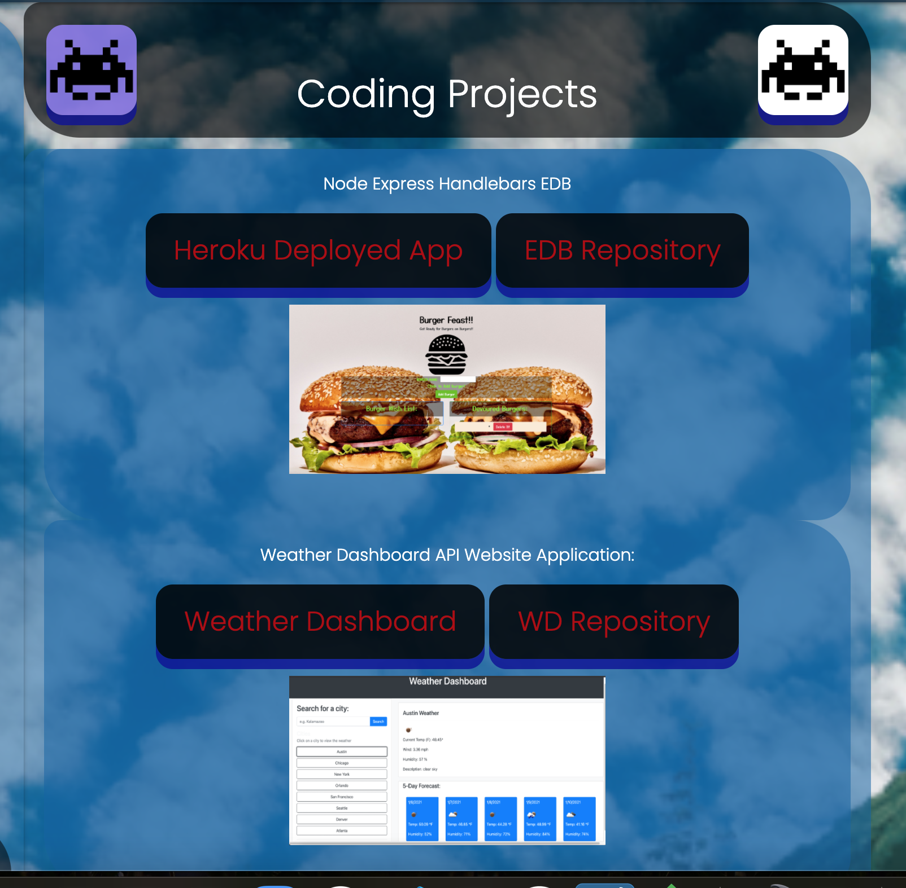
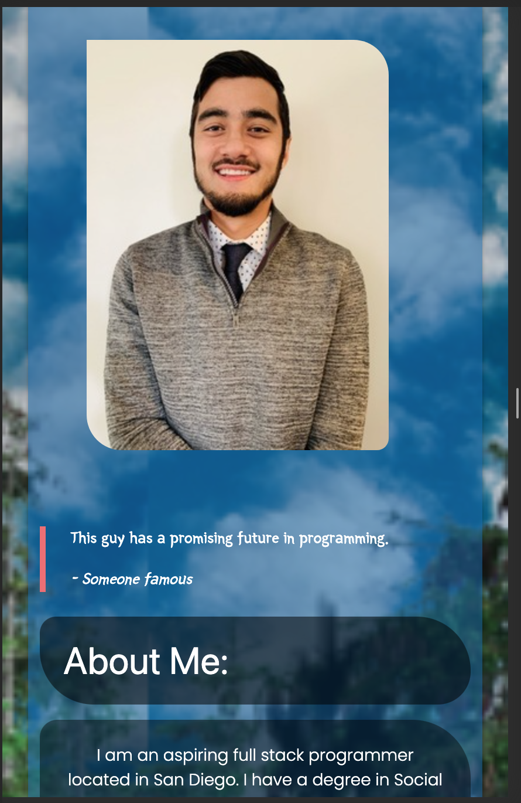

# Portfolio Update

## Purpose: 
This is an updated and polished coding portfolio, including my profile page, as well as two of my strongest coding projects to date. Below are links to my updated resume, along with a LinkedIn profile link.

Link to deployed app: https://techkospeaks.github.io/polished-portfolio/ 

## Technologies Used:
- HTML5
- Bootstrap
- CSS

## Screenshots of deployed app
Demo:

Screenshots:

## Links

Here is a link to the updated resume:
- https://docs.google.com/document/d/1iMJFDzid7c-mCA4b2vQoJPSLNOII7lex9CM5JbsaqaU/edit?usp=sharing 

Here is a link to the updated LinkedIn profile:
- https://www.linkedin.com/in/travisko/ 

Here is a link to my updated Github repository:
- https://github.com/TechKoSpeaks

## Contact Information:

Travis Ko
tkospeaks@gmail.com
206-694-3202

Licensed by MIT & Travis Ko
